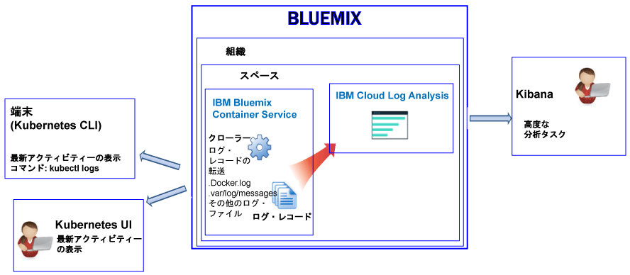
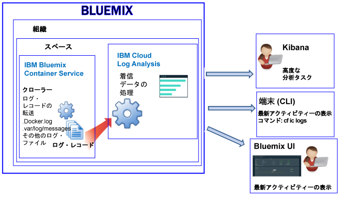

---

copyright:
  years: 2017

lastupdated: "2017-07-19"

---

{:shortdesc: .shortdesc}
{:new_window: target="_blank"}
{:codeblock: .codeblock}
{:screen: .screen}
{:pre: .pre}


# IBM Bluemix Container Service のロギング
{: #logging_containers_ov}

{{site.data.keyword.IBM}} 管理のクラウド・インフラストラクチャーにデプロイされている Docker コンテナー、および Kubernetes クラスターで実行されている Docker コンテナーのログを表示、フィルタリング、および分析できます。コンテナーのロギングは、{{site.data.keyword.Bluemix_notm}} または Kubernetes クラスターにコンテナーをデプロイした時に自動的に有効になります。
{:shortdesc}

コンテナーのログは、クローラーを使用して、コンテナーの外部からモニターおよび転送されます。データは、クローラーによって {{site.data.keyword.Bluemix_notm}} 内のマルチテナント Elasticsearch に送信されます。


## Kubernetes クラスターで実行されているコンテナーのログの収集
{: #logging_containers_ov_logs_collected_kubernetes}

以下の図は、{{site.data.keyword.containershort}} のロギングの概略を示しています。



{{site.data.keyword.Bluemix_notm}} では、Kubernetes クラスターにアプリケーションをデプロイする際に以下の情報を考慮してください。

* 1 つの {{site.data.keyword.Bluemix_notm}} アカウントで 1 つ以上の組織を持つことができます。 
* 各組織は 1 つ以上の {{site.data.keyword.Bluemix_notm}} スペースを持つことができます。 
* 1 つの組織内に 1 つ以上の Kubernetes クラスターを持つことができます。 
* ログの収集は、Kubernetes クラスターを作成した時に自動的に有効になります。 
* Kubernetes クラスターは {{site.data.keyword.Bluemix_notm}} スペースに依存しません。ただし、クラスターとリソースのログ・データは、{{site.data.keyword.Bluemix_notm}} スペースに関連付けられています。
* アプリケーションのログ・データは、pod がデプロイされるとすぐに収集されます。
* クラスターのログ・データを分析するには、クラスターが作成されている Cloud Public 領域の Kibana ダッシュボードにアクセスする必要があります。

クラスターを作成する前に、[{{site.data.keyword.Bluemix_notm}} UI](/docs/containers/cs_cluster.html#cs_cluster_ui) または[コマンド・ライン](/docs/containers/cs_cluster.html#cs_cluster_cli)を使用して、特定の {{site.data.keyword.Bluemix_notm}} 領域、アカウント、組織、およびスペースにログインする必要があります。ログインしているスペースが、クラスターとリソースのロギング・データが収集されるスペースとなります。

デフォルトで、すべてのコンテナー・プロセスが STDOUT (標準出力) および STDERR (標準エラー) に出力する情報が収集されます。情報を STDOUT および STDERR に送信することが、コンテナーの情報を公開するための標準の Docker 規則です。 

コンテナーで実行されているアプリのログ・データを、JSON フォーマットで Docker ログ・コレクターに転送すると、JSON フィールドを使用して Kibana でログ・データを検索および分析することができます。詳しくは、『[カスタム・フィールドを Kibana 検索フィールドとして構成](logging_containers_ov.html#send_data_in_json)』を参照してください。

**注:** Kubernetes クラスターで作業する場合、名前空間 *ibm-system* および *kube-system* は予約済みです。これらの名前空間で使用可能なリソースの許可を作成、削除、または変更しないでください。これらの名前空間のログは、{{site.data.keyword.IBM_notm}} の使用を目的としています。


## Bluemix によって管理されているコンテナーのログの収集
{: #logging_containers_ov_logs_collected}

以下の図は、{{site.data.keyword.containershort}} のロギングの概略を示しています。



{{site.data.keyword.Bluemix_notm}} 管理のクラウド・インフラストラクチャーにデプロイされているコンテナーの場合、以下のログがデフォルトで収集されます。

<table>
  <caption>表 2. Bluemix 管理のクラウド・インフラストラクチャーにデプロイされているコンテナーで収集されるログ</caption>
  <tbody>
    <tr>
      <th align="center">ログ</th>
      <th align="center">説明</th>
    </tr>
    <tr>
      <td align="left" width="30%">/var/log/messages</td>
      <td align="left" width="70%"> デフォルトでは、Docker メッセージは、コンテナーの /var/log/messages フォルダーに保管されます。このログには、システム・メッセージが含まれます。
      </td>
    </tr>
    <tr>
      <td align="left">./docker.log</td>
      <td align="left">このログは、Docker ログです。<br> Docker ログ・ファイルはコンテナー内にファイルとして保管されることはありませんが、収集されます。このログ・ファイルがデフォルトで収集されるのは、それがコンテナーの stdout (標準出力) 情報と stderr (標準エラー) 情報の公開に関する標準 Docker 規則であるためです。すべてのコンテナー・プロセスが STDOUT または STDERR に出力する情報が収集されます。
      </td>
     </tr>
  </tbody>
</table>

追加ログを収集するには、コンテナーの作成時にログ・ファイルへのパスを指定した **LOG_LOCATIONS** 環境変数を追加します。複数のログ・ファイルをコンマで区切って追加できます。詳しくは、『[コンテナーからの非デフォルト・ログ・データの収集](logging_containers_other_logs.html#logging_containers_collect_data)』を参照してください。


##  カスタム・フィールドを Kibana 検索フィールドとして構成 
{: #send_data_in_json}

デフォルトで、コンテナーのロギングは自動的に有効になります。Docker ログ・ファイルのすべての項目は、Kibana で `message` フィールドに表示されます。コンテナー・ログ項目の一部である特定のフィールドを使用して、Kibana でデータをフィルター操作および分析する必要がある場合は、有効な JSON フォーマットの出力を送信するようにアプリケーションを構成します。

以下の情報を考慮してください。

* Kubernetes クラスターにデプロイされているコンテナーの場合、JSON フォーマットでメッセージを STDOUT (標準出力) および STDERR (標準エラー) に記録します。

    メッセージで使用可能な各フィールドは構文解析されて、その値に一致するタイプのフィールドに変換されます。例えば、以下の JSON メッセージの各フィールドをご覧ください。
    
    ```
    {"field1":"string type",
        "field2":123,
        "field3":false,
        "field4":"4567"
    }
    ```
    
    これらの各フィールドは、以下のように、フィルター操作と検索に使用できるフィールドとして使用可能です。
    
    * `field1` は、ストリング型の `field1_str` として構文解析されます。
    * `field2` は、整数型の `field1_int` として構文解析されます。
    * `field3` は、ブール型の `field3_bool` として構文解析されます。
    * `field4` は、ストリング型の `field4_str` として構文解析されます。
    
* {{site.data.keyword.Bluemix_notm}} 管理のクラウド・インフラストラクチャーにデプロイされているコンテナーの場合、以下のステップを完了して、コンテナーのログ項目を構文解析して個別のフィールドに変換します。

    1. メッセージをファイルに記録します。 
    2. コンテナーから分析に使用できるデフォルト以外のログのリストにログ・ファイルを追加します。詳しくは、『[コンテナーからの非デフォルト・ログ・データの収集](logging_containers_other_logs.html#logging_containers_collect_data)』を参照してください。 
    
    JSON ログ項目が STDOUT としてコンテナーの Docker ログ・ファイルに送信されると、JSON として構文解析されません。 
    
    メッセージをファイルに記録し、メッセージが有効な JSON であると判別されると、フィールドが構文解析され、メッセージ内の各フィールドに対して新しいフィールドが作成されます。Kibana でのフィルター操作およびソートに使用できるのは、ストリング型のフィールド値のみになります。

## ログの取り込み
{: #log_ingestion}

{{site.data.keyword.loganalysisshort}} サービスにはさまざまなプランが用意されています。各プランでは、Log Collection にログを送信できるかどうかが定義されています。*ライト*・プランを除くすべてのプランには、Log Collection にログを送信する機能が含まれています。各種プランについて詳しくは、『[サービス・プラン](/docs/services/CloudLogAnalysis/log_analysis_ov.html#plans)』を参照してください。

マルチテナント Logstash Forwarder を使用することによって、ログを {site.data.keyword.loganalysisshort}} に送信できます。詳しくは、『[マルチテナント Logstash Forwarder (mt-logstash-forwarder) を使用したログ・データの送信](/docs/services/CloudLogAnalysis/how-to/send-data/send_data_mt.html#send_data_mt)』を参照してください。


## ログ収集
{: #log_collection}

デフォルトでは、{{site.data.keyword.Bluemix_notm}} はログ・データを最大 3 日間保管します。   

* スペースごとに 1 日に最大で 500 MB のデータが保管されます。500 MB の上限を超えるログは破棄されます。上限割り当ては、毎日午前 12:30 (UTC) にリセットされます。
* 1.5 GB までのデータを最大 3 日間検索可能です。ログ・データは、データが 1.5 GB に達するか 3 日が過ぎると、ロールオーバーします (先入れ先出し)。


{{site.data.keyword.loganalysisshort}} サービスには、必要な期間 Log Collection にログを保管できる追加プランがあります。各プランの料金について詳しくは、『[サービス・プラン](/docs/services/CloudLogAnalysis/log_analysis_ov.html#plans)』を参照してください。

Log Collection 内でログを保持する日数を定義するために使用できるログ保存ポリシーを構成できます。詳しくは、『[ログ保存ポリシー](/docs/services/CloudLogAnalysis/log_analysis_ov.html#policies)』を参照してください。


## ログ検索
{: #log_search}

デフォルトでは、{{site.data.keyword.Bluemix_notm}} では、1 日当たり 500 MB までのログを Kibana を使用して検索できます。 

{{site.data.keyword.loganalysisshort}} サービスには複数のプランが用意されています。ログ検索の機能はプランによって異なります。例えば、*ログ収集*プランでは、1 日当たり 1 GB までのデータを検索できます。各種プランについて詳しくは、『[サービス・プラン](/docs/services/CloudLogAnalysis/log_analysis_ov.html#plans)』を参照してください。


## Kubernetes クラスターで実行されているコンテナーのコンテナー・ログの表示
{: #logging_containers_ov_methods_view_kube}

以下のいずれかの方法を使用して、Kubernetes pod 内のコンテナーの最新ログを表示することができます。

* Kubernetes UI を使用してログを表示します。それぞれの pod について選択し、ログにアクセスすることができます。詳しくは、「[Web UI ダッシュボード ](https://kubernetes.io/docs/tasks/access-application-cluster/web-ui-dashboard/ "外部リンク・アイコン"){: new_window}」を参照してください。

* Kubernetes CLI コマンド [kubectl logs ](https://kubernetes-v1-4.github.io/docs/user-guide/kubectl/kubectl_logs/ "外部リンク・アイコン"){: new_window} を使用してログを表示します。 

長期間のログを表示するには、Kibana を使用できます。データ保存期間ポリシーについては、『[サービス・プラン](/docs/services/CloudLogAnalysis/log_analysis_ov.html#plans)』を参照してください。


## Bluemix によって管理されているコンテナーのコンテナー・ログの表示
{: #logging_containers_ov_methods_view_bmx}

{{site.data.keyword.Bluemix_notm}} 管理のクラウド・インフラストラクチャーにデプロイされているコンテナーの最新ログは、以下のいずれかの方法を使用して表示できます。

* {{site.data.keyword.Bluemix_notm}} UI を介してログを表示して、コンテナーの最新のアクティビティーをモニターします。
    
    各コンテナーに対して使用可能な**「モニターおよびログ (Monitoring and logs)」**のタブを使用してログの表示、フィルタリング、および分析を行うことができます。詳しくは、『[Bluemix ダッシュボードからのログの分析](/docs/services/CloudLogAnalysis/logging_view_dashboard.html#analyzing_logs_bmx_ui)』を参照してください。
    
    
* {{site.data.keyword.containershort}} CLI を使用してログを表示します。コマンドを使用して、プログラマチックにログを管理します。
    
    **cf ic logs** コマンドを使用することによって、ログの表示、フィルター操作、および分析をコマンド・ライン・インターフェースを介して行うことができます。詳しくは、『[コマンド・ライン・インターフェースからのログの分析](/docs/services/CloudLogAnalysis/logging_view_cli.html#analyzing_logs_cli)』を参照してください。


## コンテナー・ログの分析
{: #logging_containers_ov_methods}

コンテナー・ログ・データを分析するには、Kibana を使用して高度な分析タスクを実行します。分析および視覚化のためのオープン・ソース・プラットフォームである Kibana を使用して、さまざまなグラフ (図表や表など) でデータのモニター、検索、分析、および視覚化を行うことができます。詳しくは、『[Kibana でのログの分析](/docs/services/CloudLogAnalysis/kibana/analyzing_logs_Kibana.html#analyzing_logs_Kibana)』を参照してください。


## チュートリアル: Kubernetes クラスターにデプロイされているアプリのログを Kibana で分析
{: #tutorial1}

Kibana を使用した、Kubernetes クラスターにデプロイされているコンテナーのログの分析方法を学習するには、[チュートリアル: Kubernetes クラスターにデプロイされているアプリのログを Kibana で分析](/docs/services/CloudLogAnalysis/containers/tutorials/kibana_tutorial_1.html#kibana_tutorial_1)を参照してください。


